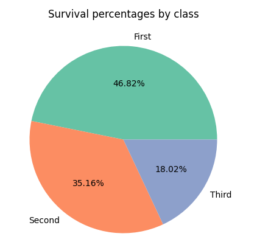

# Titanic-Detailed Analysis

## Project Overview

This project presents a detailed analysis of the Titanic dataset, a built-in dataset available in Seaborn. The focus is on exploratory analysis rather than predictive modeling.

Key points:
- The dataset reflects historical events, which cannot be exactly reproduced today, as modern ships have advanced safety technologies and different operating conditions.
- Building predictive models on this dataset would be inappropriate, since there is no contemporary scenario to validate them.
- The analysis explores survival patterns among passengers, considering features such as age, class, gender, family status, and deck level.
- Examining the deck levels helps to understand whether a passenger’s location on the ship influenced survival chances.
- Insights from this study can be useful for educational, historical, and research purposes, providing a deeper understanding of the factors that affected survival during the Titanic disaster.
  
## Data Preprocessing

- The deck feature has 203 non-missing values out of 891 records.  
- Due to this large proportion of missing data, any analysis based on deck may be biased.  
- Missing values were handled using KNN imputation to fill gaps, but readers should interpret results involving deck with caution.

## Data Exploration & Features

The analysis focused on the following features from the Titanic dataset:

- Age – the passenger's age.  
- Gender (sex) – male or female.  
- Deck – passenger’s deck level (before and after KNN imputation).  
- Family status (sibsp and parch) – number of siblings/spouses and parents/children aboard.  
- Who – categorizes passengers as man, woman, or child.  
- Adult Male (adult_male) – indicates if the passenger is an adult male.  
- Embarkation (embarked) – port where the passenger boarded (C = Cherbourg, Q = Queenstown, S = Southampton).  
- Alone – whether the passenger was traveling alone.  
- Passenger Class (pclass) – socio-economic class of the passenger (1st, 2nd, 3rd).  

These features were used to explore survival patterns and generate meaningful visualizations using Matplotlib and Seaborn.
## Visualizations

